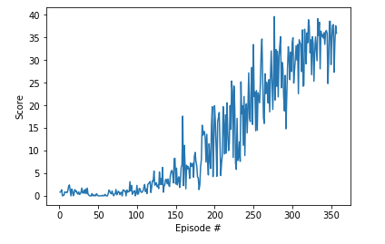

## Project 2: Continuous Control report

## Table of content
* [I. Introduction](#introduction)
* [II. Learning algorithms](#learning-algo)
  * [II.1 DDPG Pendulum algorithm as a default choice](#ddpg-pendulum)
  * [II.2 Hyperparameters tuning](#hyper-tuning)
* [III. Ideas for future work](#future-work)

## I. Introduction
<a id="introduction"></a>

For this project, you will work with the [Reacher](https://github.com/Unity-Technologies/ml-agents/blob/master/docs/Learning-Environment-Examples.md#reacher) environment.

In this environment, a double-jointed arm can move to target locations. A reward of +0.1 is provided for each step that the agent's hand is in the goal location. Thus, the goal of your agent is to maintain its position at the target location for as many time steps as possible.

The observation space consists of 33 variables corresponding to position, rotation, velocity, and angular velocities of the arm. Each action is a vector with four numbers, corresponding to torque applicable to two joints. Every entry in the action vector should be a number between -1 and 1.

The task is episodic, and in order to solve the environment, the agent must get an average score of +3O over 100 consecutive episodes.


## II. Learning algorithms
<a id="learning-algo"></a>

The goal of this project is to implement an actor-critic Deep Reinforcement Learning to solve an environment where both states and actions are continuous. Solutions such as Discretization, Tile or coarse coding are well-known methods used for continuous environment but have shown poor scalability properties. Instead, we chose to implement state of the art [DDPG (Deep Deterministic Policy Gradient)](https://arxiv.org/abs/1509.02971) algorithm.


### II.1 DDPG Pendulum algorithm as a default choice
<a id="ddpg-pendulum"></a>

We first implemented out-of-the box DDPG algorithm solving OpenAI pendulum environment using the same hyperparameters as a baseline.

* **Hyperparameters**
```
# Runner
n_episodes=2000         # maximum number of training episodes
max_t=1000              # maximum number of timesteps per episode

# Agent
BUFFER_SIZE = int(1e5)  # replay buffer size
BATCH_SIZE = 128        # minibatch size
GAMMA = 0.99            # discount factor
TAU = 1e-3              # for soft update of target parameters
LR_ACTOR = 1e-4         # learning rate of the actor 
LR_CRITIC = 1e-3        # learning rate of the critic
WEIGHT_DECAY = 0        # L2 weight decay

# Neural Networks
hidden_layers = [400, 300]
```

* **Outcome**
This default implementation shows poor performance:
* learning extremely slow
* struggling even reaching an average score of 1

### II.2 Hyperparameters tuning
<a id="hyper-tuning"></a>

Tuning hyperparameters through trial-and-error experimentations is long, sometimes frustrating and ultimately rewarding process. 

After hours of experimentation, we've finally focused on three axis of optimization: 

* speed of learning,
* variety of experience;
* stability.

* **Speed of learning**

Indeed, we first noticed that learning at every single time step critically slows down the learning process as gaining experience (stored into the replay buffer) takes longer. Instead, we only **enter the learning phase every 20 time steps**:

```
def ddpg(n_episodes=1000, max_t=1000, print_every=100, learn_every=20, solved_score = 30):
    scores_deque = deque(maxlen=print_every)
    scores = []
    for i_episode in range(1, n_episodes+1):
        env_info = env.reset(train_mode=True)[brain_name]
        state = env_info.vector_observations[0]                       
        
        agent.reset()
        score = 0
        
        for t in range(max_t):
            action = agent.act(state)
            next_state, reward, done = unity_step_wrap(action)
            agent.save_experience(state, action, reward, next_state, done)

            score += reward
            state = next_state
            
            if t % learn_every == 0:
                agent.step()
            
            if done:
                break 

        scores_deque.append(score)
        scores.append(score)
        print('\rEpisode {}\tAverage Score: {:.2f}'.format(i_episode, np.mean(scores_deque)), end="")
        torch.save(agent.actor_local.state_dict(), 'checkpoint_actor.pth')
        torch.save(agent.critic_local.state_dict(), 'checkpoint_critic.pth')
        if i_episode % print_every == 0:
            print('\rEpisode {}\tAverage Score: {:.2f}'.format(i_episode, np.mean(scores_deque)))
            
        if np.mean(scores_deque) > solved_score:
            break
        
    return scores
```

* **Variety of experience**

Despite the speed up of nb. of experiences collected over time, the learning was still very slow. We realized that increasing both replay buffer and batch sizes allow not only to gain experiences much faster but rather to have much greater and representative batches of samples to tap into.

* **Stability**

After an early enthousiasm: faster learning, scores increasing toward 25, we finally realized that the score was finally decreasing again. In order to try stabilizing the learning we first add Batch normalization into both Actor and Critic Neural Networks without much success. We finally added **gradient clipping** to the Critic network as suggested into the "Benchmark implementation" learning material.

This last round of optimization (see hyperparameters below) was a game changer and we finally managed to train the agent in about 300 episodes.

* **Hyperparameters**
```
# Runner
n_episodes=1000         # maximum number of training episodes
max_t=1000              # maximum number of timesteps per episode

# Agent
BUFFER_SIZE = int(1e6)  # replay buffer size
BATCH_SIZE = 1024        # minibatch size
GAMMA = 0.99            # discount factor
TAU = 1e-3              # for soft update of target parameters
LR_ACTOR = 1e-3         # learning rate of the actor 
LR_CRITIC = 1e-3        # learning rate of the critic
WEIGHT_DECAY = 0        # L2 weight decay

# Neural Networks
hidden_layers = [400, 300]
```
* **Plot of Scores over time steps**




## III. Ideas for future work
<a id="future-work"></a>

In order to pursue in DDPG's side and assess possibility of further improvements:
1. it would be interesting to investigate how running 20 agents in parallel would improve or worse learning;
2. consider more systematic hyperparameters tuning through grid search.

As a comparison, it would be interesting to implement PPO and D4PG algorithms.


