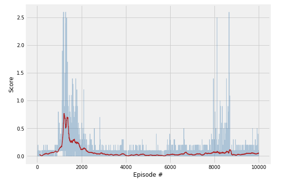

## Project 3: Collaboration and competition

## Table of content
* [I. Introduction](#introduction)
* [II. Learning algorithms](#learning-algo)
* [III. Ideas for future work](#future-work)

## I. Introduction
<a id="introduction"></a>

For this project, we worked with the [Tennis](https://github.com/Unity-Technologies/ml-agents/blob/master/docs/Learning-Environment-Examples.md#tennis) environment.

In this environment, two agents control rackets to bounce a ball over a net. If an agent hits the ball over the net, it receives a reward of +0.1.  If an agent lets a ball hit the ground or hits the ball out of bounds, it receives a reward of -0.01.  Thus, the goal of each agent is to keep the ball in play.

The observation space consists of 8 variables corresponding to the position and velocity of the ball and racket. Each agent receives its own, local observation.  Two continuous actions are available, corresponding to movement toward (or away from) the net, and jumping. 

The task is episodic, and in order to solve the environment, your agents must get an average score of +0.5 (over 100 consecutive episodes, after taking the maximum over both agents). Specifically,

- After each episode, we add up the rewards that each agent received (without discounting), to get a score for each agent. This yields 2 (potentially different) scores. We then take the maximum of these 2 scores.
- This yields a single **score** for each episode.

The environment is considered solved, when the average (over 100 episodes) of those **scores** is at least +0.5.


## II. Learning algorithms
<a id="learning-algo"></a>

The goal of this project is to Deep Reinforcement Learning algorithms to solve an environment where:
* both states and actions are continuous
* two agents play against each others.

[DDPG (Deep Deterministic Policy Gradient)](https://arxiv.org/abs/1509.02971) algorithm is one of the state-of-the-art technique to handle efficiently continuous states and actions. Furthermore, successful attempts to adapt DDPG to multi-agent settings have been carried out [Multi-Agent Actor-Critic for Mixed
Cooperative-Competitive Environments](https://papers.nips.cc/paper/7217-multi-agent-actor-critic-for-mixed-cooperative-competitive-environments.pdf) allowing to address, in particular, issues of environment non-stationarity and where agent populations are able to discover various physical and informational coordination strategies.

However, in our specific scenario, it is important to recognize the symetrical nature of the problem as both agents:
* receive same type of reward;
* observe same type of states;
* and have same actions space.

As a result, our first approach was "simply" to re-use/adapt **DDPG algorithm in a multi-agent setting** where each agent:
* store their experiences in a shared replay buffer and;
* share the same actor and critic network.

Based on lessons learnt from previous project "Continuous controle (Reacher environment)", we tuned hyperparameters along the following axis of optimization:

* **speeding learning** by training both Actor and Critic networks **2 times every 5 actions**. That way, we were able to accumulate experience (in shared experience replay buffer quite rapidly);
* **increase variety of experiences** by tweaking both BUFFER BATCH SIZE of the experience replay buffer and;
* **stability** through clipping gradient and batch normalization.

Additionnaly, we noticed that the **exploration/exploitation strategy** is decisive in solving the environment. By now, toward the end of this Deep Reinforcement Learning nanodegree we are fully aware that's a key aspect of the field still challenging. 

However, in our particular case we adopted the following simple strategy: decaying the action noise (Ornstein-Uhlenbeck process noise) exponentially to a chosen minimum threshold after n episodes as shown below:

```
noise = 1.0
min_noise = min_noise
noise_reduction = min_noise**(1/n_episodes)
```

Below an overview of all hyperparameters allowing to solve the environment:

* **Hyperparameters**
```
# Runner
n_episodes=10000        # maximum number of training episodes
min_noise=0.02            # maximum number of timesteps per episode

# Agent
BUFFER_SIZE = int(1e6)  # replay buffer size
BATCH_SIZE = 512        # minibatch size
GAMMA = 0.99            # discount factor
TAU = 1e-3              # for soft update of target parameters
LR_ACTOR = 1e-3         # learning rate of the actor 
LR_CRITIC = 1e-3        # learning rate of the critic
WEIGHT_DECAY = 0        # L2 weight decay

# Neural Networks (both Actor & Critic)
hidden_layers = [128, 64]
```

* **Outcome**
Using this setup and after hyperparameters tuning (and after many trial and errors attempts), the environment was solved in about 1180 episodes (but worth noting that training took part only every 5 actions) in less than 5 min on a laptop and without GPU.

Below the plot of score over time steps:


And trained agents in action:


## III. Ideas for future work
<a id="future-work"></a>


In order to pursue in DDPG's side and assess possibility of further improvements:
1. it would be interesting to investigate how implementing a truly multi-agent version of DDPG would improve the learning;
2. for more systematic optimization and given the impact of the random seeds on performance, it would be interesting to more systematically (grid-search for instance) explore the hyperparameters space over various random seeds;
3. last, it would be worth investigating how to stabilize the learning over time/episodes especially. The plot below highlighting the instability of the learning after having solved the environment.




