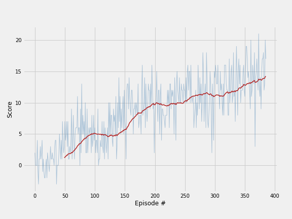

## Project 1: Navigation report

## Table of content
* [I. Introduction](#introduction)
* [II. Learning algorithms](#learning-algo)
  * [II.1 Vanilla DQN](#vanilla-dqn)
  * [II.2 Vanilla DQN with lower exploration](#dqn-lower-exploration)
  * [II.3 Vanilla DQN with more systematic hyperparameters tuning](#dqn-tuning)

## I. Introduction
<a id="introduction"></a>

For this project, we will train an agent to navigate (and collect bananas!) in a large, square world.  

A reward of +1 is provided for collecting a yellow banana, and a reward of -1 is provided for collecting a blue banana.  Thus, the goal of the agent is to collect as many yellow bananas as possible while avoiding blue bananas.  

The state space has 37 dimensions and contains the agent's velocity, along with ray-based perception of objects around agent's forward direction.  Given this information, the agent has to learn how to best select actions.  Four discrete actions are available, corresponding to:
- **`0`** - move forward.
- **`1`** - move backward.
- **`2`** - turn left.
- **`3`** - turn right.

The task is episodic, and in order to solve the environment, the agent must get an average score of +13 over 100 consecutive episodes.


## II. Learning algorithms
<a id="learning-algo"></a>

The goal of this project is to implement value-based Deep Reinforcement Learning algorithms in order to solve Unity Bananas' environment. We have at our disposal a series of algorithms from Deep Q-network (DQN), double DQN, Prioritized Replay DQN, Dueling DQN, ...

Our approach consists in:
1. re-use Vanilla DQN with hyperparameters used to solve OpenAI Gym Lunar Landing environment;
2. based on visual observation of agent's behaviour during learning, guessing more optimal hyperparameters;
3. explore more systematically hyperparameters space to find out "best parameters";
4. implement one of the improved version of DQN (Double DQN in our case).

### II.1 Vanilla DQN with default parameters
<a id="vanilla-dqn"></a>

We first implemented a Vanilla DQN approach with the followin agent and DQN hyperparameters:

```
n_episodes=2000                   # maximum number of training episodes
max_t=1000                        # maximum number of timesteps per episode
eps_start=1.0                     # starting value of epsilon, for epsilon-greedy action selection
eps_end=0.01                      # minimum value of epsilon
eps_decay=0.995                   # multiplicative factor (per episode) for decreasing epsilon

hidden_layers=[64, 64]            # nb. of hidden layers and unit per layer of neural network
buffer_size=int(1e5)              # size of replay buffer
batch_size=64                     # learning samples batch size
gamma=0.99                        # discount factor
lr=0.0005                         # learning rate
```

It is important to note that the choice of these parameters is somewhat arbitrary and simply inherited from a previous environment. However, as a first attempt, keeping exploration high with a large discount factor looks sensible.

The plot below shows that although this quite arbitrary choice, the agent is able to learn and solve the environment in less than 500 episodes.


### II.2 Vanilla DQN with lower exploration
<a id="dqn-lower-exploration"></a>

Finding out a relevant exploration vs. exploitation strategy is central to Reinforcement Learning and one of the biggest challenge. In our particular context, watching the agent learning, we notice that:
* based on agent distance from closest bananas exploration required may vary (it looks a bit irrelevant to oscillate many times left, right, ... at each step when closest bananas are far away);
* at the same time, the agent gets hooked by walls quite often and need randomness in order to get off the wall and continue its "trip".

**Here we decide to decrease `eps_start` to 0.5.**

We can see that indeed, the agent solve the environment in almost 400 episodes instead.


### II.3 Vanilla DQN with more systematic hyperparameters tuning
<a id="dqn-tuning"></a>

In that part, we want to test a more systematic exploration of hyperparameters space. Exploring a large state space along many dimensions and episodes might take a week. Instead, as a proof-of-concept we have simply explored the following hyperparameters space:

```
eps_start = [0.4, 0.5, 0.6]
gamma = [0.97, 0.98, 0.99]
lr = [0.0001, 0.00025, 0.0005]

# With the following fix hyperparameters
eps_end=0.01                      # minimum value of epsilon
eps_decay=0.995                   # multiplicative factor (per episode) for decreasing epsilon
hidden_layers=[64, 64]            # nb. of hidden layers and unit per layer of neural network
buffer_size=int(1e6)              # size of replay buffer
batch_size=128                    # learning samples batch size
```

and keep the ones having the highest mean over the last 5 episodes out of 10 episodes in total. Again, in a real scenario, we would have explored a much broader set of values over many dimensions and over 400 episodes for instance. In particular, focusing on the first episodes where exploration is large introduce a lot of randomness hence our "best" hyperparameters should be put in perspective.

Nevertheless, after exploration of this hyperparameters (sub)space, we get the following "best" ones:

```
eps_start = 0.4 # epsilon-greedy initial exploration level
gamma = 0.97    # discount factor
lr = 0.0001     # learning rate
```

We now apply this parameters to a Vanilla DQN agent and indeed see a much faster learning.


## Ideas for future work

